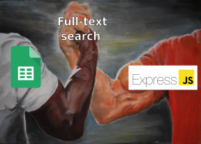
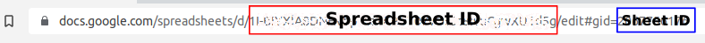

# Example of A full-text search query using google sheets api with express js

<div style="text-align:center;display:flex;justify-content:center;">

</div>

## Overview
This is an example of how you can implement google sheets API to build your Full text search API in node js using Express. 

### Step 1: Authenticating your google sheet API
[By following this this docs](./resource%26docs/README.md) 
setup your google sheets from google cloud console.
Then download your generated api credentials (which is just a JSON file with authentication credentials) copy ***private_key*** and ***client_email*** value and paste them to a .env file at the root of your directory.

    
( Just rename **.env.example** to **.env** ):

```
./env

CLIENT_EMAIL = **YOUR COPIED client_email **
PRIVATE_KEY =  **YOUR COPIED private_key**
```

<br/>

### Step: 2: Create a spreadsheet in google sheets
1. Go to [https://docs.google.com/spreadsheets](https://docs.google.com/spreadsheets).
2. Create a blank sheet.
3. Import [the **IMDB bengali movies.csv** from resource&docs](./resource&docs/IMDB bengali movies.csv) in your newly created blank sheet or just bring your own data.
4. Click on **Share**, Change get link's privacy to **Anyone with link** (Make sure it's selected as Viewer). If you need the sheet to be restricted then you would require an OAuth 2.0 credentials for authorization. That is for another time.
5. Copy the **Spreadsheet ID** and **sheet ID** from the url, paste the spreadsheet ID in .env file.

    ```
    ./env


      SPREADSHEETID = **YOUR COPIED SPREADSHEETID**  
    ```


    

<br/>

### Step 3: Clone this repo
1. In the terminal of your PC:
    ``` git clone https://github.com/khandakar227/google-sheet-api-full-text-search ```
2. Install all the dependencies with ``` npm i ```
    or if you use yarn ``` yarn add ```

3. then run
``` npm run start```
A server will start running in on port 8080

4. Go to https://localhost:8080/movies?search=**keyword** replace keyword with any word you like.

5. check all the files. especially ``` moviesHandler.js ```.

## 🚀 Project Structure

Inside of this project, you'll see the following folders and files:
```
/
├── api/
│    └── movies.js         //this is the route where we request for data
│
├── handlers/
│    └── moviesHandler.js  //a resquest and response handler 
│
├── libs/
│    └── index.js          
│
└── index.js              //Main entry file
│
└── .env.example          //Change it to .env    
│
└── package.json
```

### For Typescript support
Run 

```
 npm i -D @types/cors @types/express @types/node @types/papaparse 

 npm i typescript ts-node
```


Don't forget to rename and refactor all the js files you need for typescript ( *.js > *.ts )

### Caveats
1. It is highly recommended that you do not save sensitive information ie. passwords and contact numbers in your sheet/database. You need to use OAuth 2.0 authrization credentials for that (Which will help you query from a restricted spreadsheet).

2. The new Google Sheets API v4 currently has an unlimited read/write quota per day (which is fantastic), but restricted to 500 reads/writes per account per 100 seconds, and 100 read/writes per key per 100 seconds.

3. It does not support relationships.

4. It is non ACID Compliant.

### References
1. [Query language reference](https://developers.google.com/chart/interactive/docs/querylanguage).