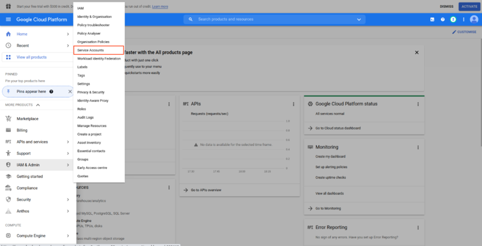
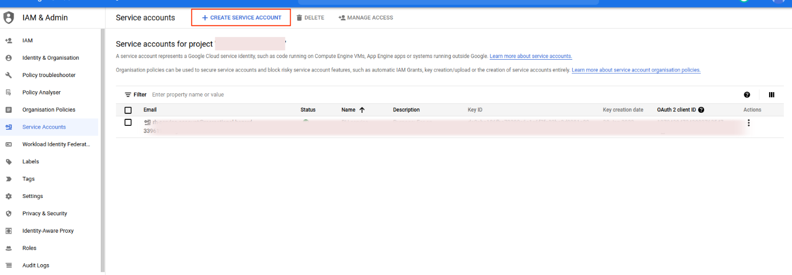
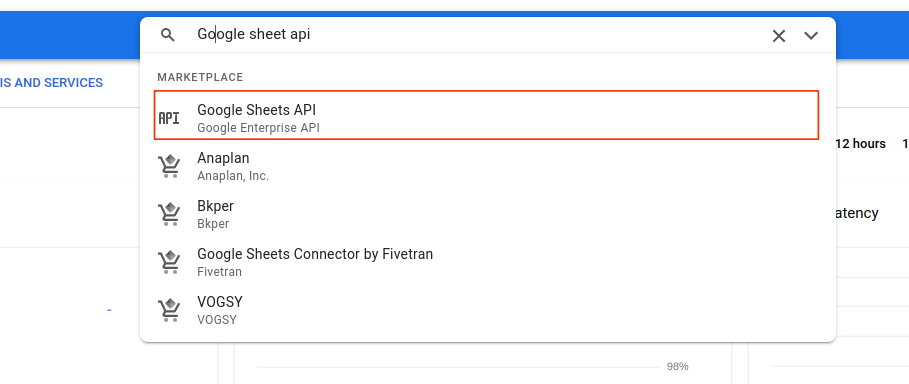
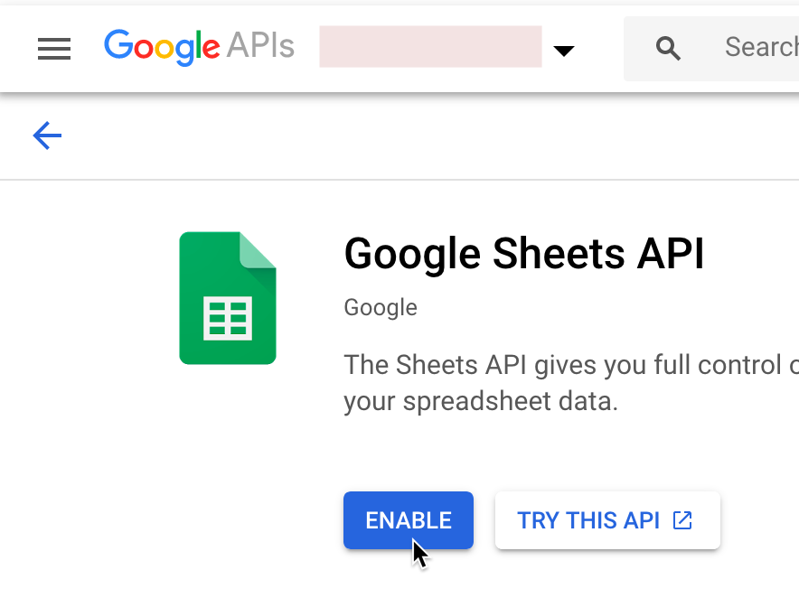
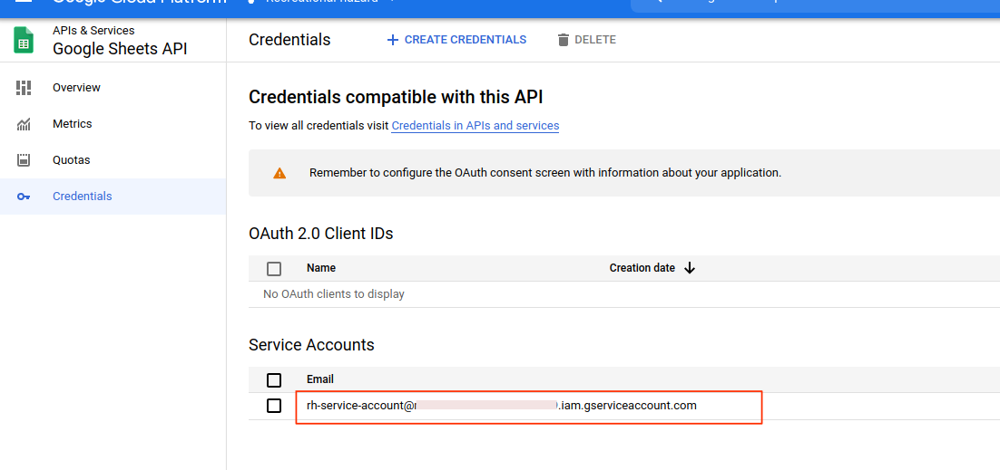
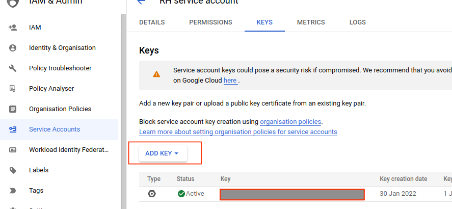

# Authenticating Google Sheets API

### Step 1:
1. Go to [google cloud console](https://console.cloud.google.com). In the navigation menu go to **IAM & Admin** > **Service Accounts**

2. Create service account.

.

3. Search for Google Sheet API. Enable it and wait for a few seconds it will redirect you to api & services

4. From there go to Credentials. Click on your service account.

5. Click **on add key** > **Create new key**. Your authentication credentials will be downloaded (which is a JSON file). ***Keep it private.*** It is a super secret file that should not be in public. 

6. Copy the **client_email** and **private_key** value to your .env file.
